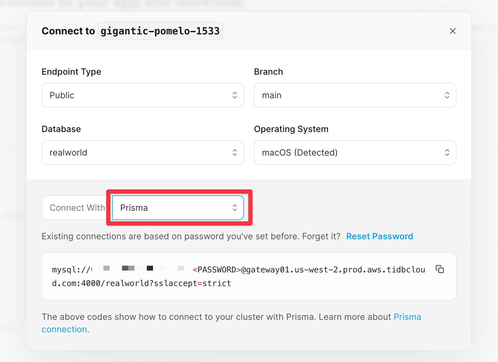

# RealWorld example app with TiDB Serverless

A [RealWorld example app](https://github.com/gothinkster/realworld) built with [Next.js](https://nextjs.org/), [Prisma](https://www.prisma.io/) and [TiDB Serverless](https://tidbcloud.com/).

## Getting Started

### One-click Deploy on Vercel

You can deploy this template to Vercel with the button below:

[](https://vercel.com/new/clone?repository-url=%3Dhttps%3A%2F%2Fgithub.com%2Flikidu%2Frealworld-nextjs%26env%3DNEXTAUTH_SECRET%26project-name%3Drealworld-nextjs%26repository-name%3Drealworld-nextjs%26demo-title%3DRealWorld%20with%20TiDB%20Serverless%26demo-description%3DA%20RealWorld%20example%20app%20built%20with%20Next.js%2C%20Prisma%20and%20TiDB%20Serverless.%26demo-url%3Dhttps%3A%2F%2Fraw.githubusercontent.com%2Flikidu%2Frealworld-nextjs%2Fmain%2Fdocs%2Frealworld-nextjs-tidb-serverless.png%26integration-ids%3Doac_coKBVWCXNjJnCEth1zzKoF1j)

### Prerequisites

- [Node.js](https://nodejs.org/en/) – JavaScript runtime
- [pNPM](https://pnpm.io/) – Package manager
- [TiDB Serverless](https://tidbcloud.com/) account – Serverless cloud database

### Set up database

Register an account on [TiDB Serverless](https://tidbcloud.com/) and [create a new database in the cluster](https://docs.pingcap.com/tidbcloud/tidb-cloud-quickstart).

Then you can [find the connection string](https://docs.pingcap.com/tidbcloud/connect-via-standard-connection-serverless) in the portal that will later be used to configure the `.env` file to connect to the database.

We will select **Connect with Prisma** as the connection method.



### Set up RealWorld app locally

First, clone this repository:

```bash
git clone https://github.com/likidu/realworld-nextjs
```

And then install dependencies:

```bash
pnpm install
```

Next, rename `.env.example` to `.env` and fill in the database connection string you got from the previous step. And also the `NEXTAUTH_SECRET` which is used to encrypt the session in `localhost`.

Now push the database schema to your TiDB Serverless database using Prisma.

```bash
pnpm prisma db push
```

Run the seed script to populate your database with some initial data.

```bash
pnpm prisma db seed
```

The [seed script](./prisma/seed.ts) will first clean up the existing records and create a few mocking users and posts.

### Run the app

Finally, run the development server:

```bash
pnpm run dev
```

Open [http://localhost:3000](http://localhost:3000) with your browser to see the result.


To test with Sign in, use the following credentials:

```
Email: user@tidb.link
Password: 123456
```

## Learn More

To learn more about TiDB Serverless, take a look at the following resources:

- [TiDB Serverless Documentation](https://docs.pingcap.com/tidbcloud/) - learn about TiDB Serverless features and get started to build your application.

## Tech Stack

### Platforms

- [TiDB Serverless](https://tidbcloud.com/) – Serverless cloud database that is MySQL compatible

### Frameworks

- [Next.js](https://nextjs.org/) – React framework for building performant apps with the best developer experience
- [Auth.js](https://authjs.dev/) – Handle user authentication with ease with providers like Google, Twitter, GitHub, etc.
- [Prisma](https://www.prisma.io/) – Typescript-first ORM for Node.js

### UI

- [Tailwind CSS](https://tailwindcss.com/) – Utility-first CSS framework for rapid UI development
- [Shadcn-UI](https://ui.shadcn.com/) – [Radix UI](https://www.radix-ui.com/) based components that you can copy and paste into your apps
- [`next/font`](https://nextjs.org/docs/basic-features/font-optimization) – Optimize custom fonts and remove external network requests for improved performance

### Utilities

- [Faker.js](https://fakerjs.dev/) - Generate seeding data for testing and development
- [bcrypt for Node.js](https://github.com/kelektiv/node.bcrypt.js) - A library to help you hash passwords before saving and reading from database
- [html-react-parser](https://github.com/remarkablemark/html-react-parser) – Parse HTML post strings into React components
- [lodash](https://lodash.com/) – For sampling random elements from an array

### Code Quality

- [TypeScript](https://www.typescriptlang.org/) – Static type checker for end-to-end typesafety
- [Prettier](https://prettier.io/) – Opinionated code formatter for consistent code style
- [ESLint](https://eslint.org/) – Pluggable linter for Next.js and TypeScript
